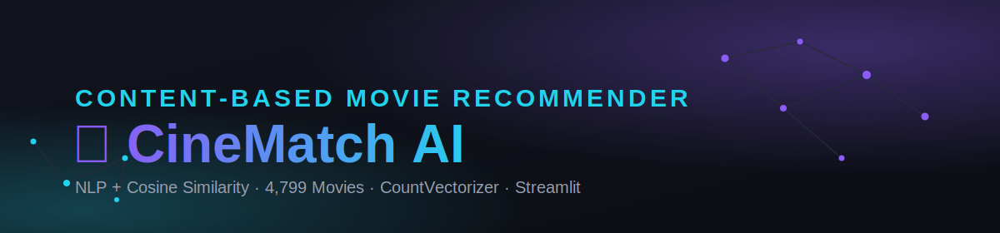
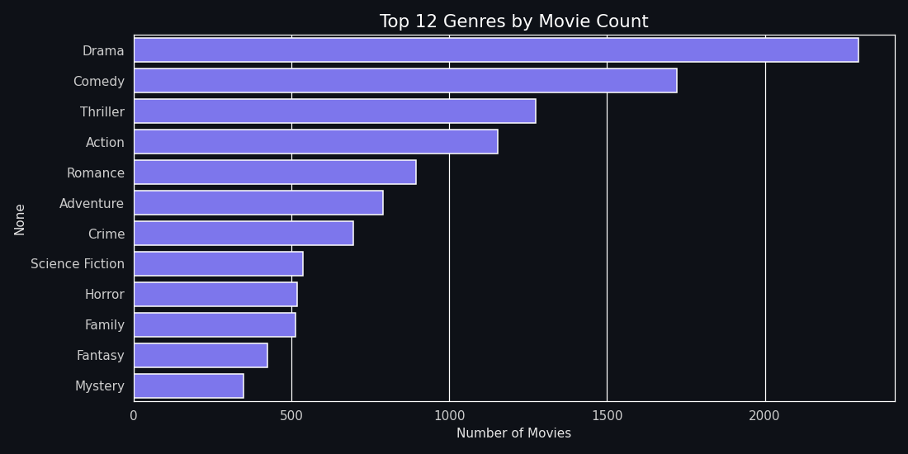
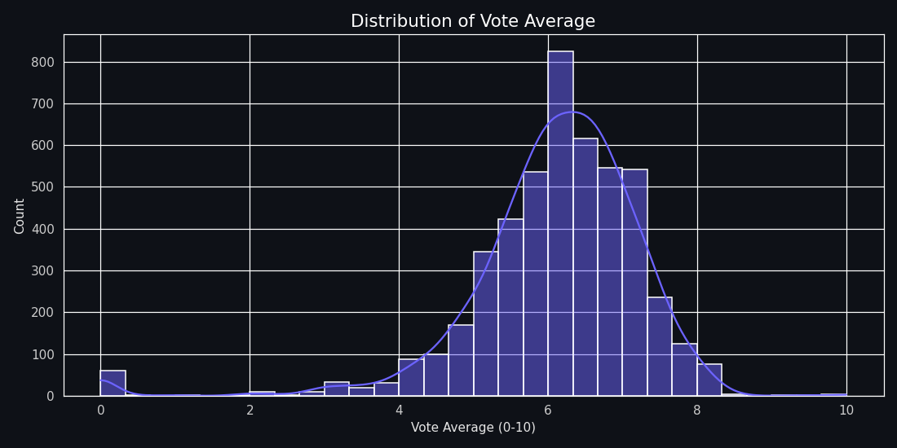
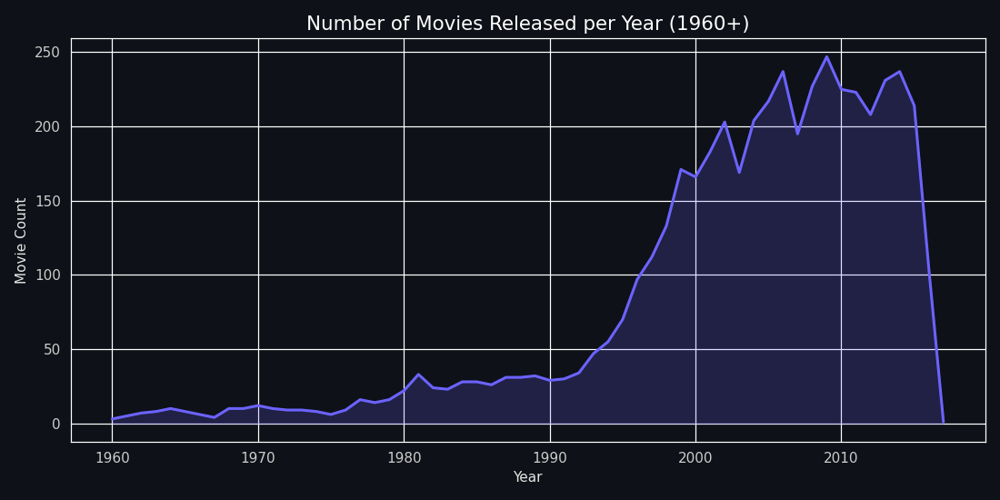

<p align="center">
  
</p>

<h1 align="center">CineMatch AI — Movie Recommendation System</h1>
<p align="center"><i>Content-based movie recommendations powered by NLP and cosine similarity, served through a production-style Streamlit dashboard.</i></p>

<p align="center">
  
  
  
  
</p>

<p align="center">
  <a href="#features">Features</a> ·
  <a href="#screenshots">Screenshots</a> ·
  <a href="#tech-stack">Tech Stack</a> ·
  <a href="#how-it-works">How It Works</a> ·
  <a href="#getting-started">Getting Started</a> ·
  <a href="#deployment">Deployment</a> ·
  <a href="#future-improvements">Roadmap</a>
</p>

---

> **Project status:** mid-redesign into a full discovery platform. Phase 2 (architecture refactor,
> UI redesign, authentication, internationalization) is complete. Phases 3-6 (smart multi-field
> search, Movie Details page, recommendation modes, expanded analytics, deployment) are planned —
> see [Roadmap](#future-improvements).

## Overview

CineMatch AI recommends movies based on **content** — plot overview, genre, keywords, top-billed
cast, and director — rather than collaborative signals like ratings or watch history. Pick a movie
you like, and it returns the 10 most similar titles from the **TMDB 5000 Movie Dataset**, each with
a similarity score and confidence rating.

The whole pipeline is real and reproducible: four Jupyter notebooks take the raw TMDB CSVs all the
way to a pickled, production-ready model that the Streamlit app loads directly.

## Features

- 🔎 **Fuzzy search** (RapidFuzz) — typos and partial titles still resolve to the right movie
- 🎯 **Top-N recommendations** with a similarity-confidence meter, poster, genre, year, and rating
- **Accounts** — registration and login (username, email, phone, password), with bcrypt-hashed
  passwords and per-user data in SQLite (favorites, watchlist, history, ratings, preferences)
- **5-language UI** — English, Hindi, Marathi, Spanish, Japanese, switchable in Settings and
  persisted per account
- 📊 **Interactive analytics dashboard** — genre breakdowns, rating/runtime distributions, release
  trends, and similarity-score distribution, all with live filters (Plotly)
- 🕓 **Search history & recently viewed**, trending and top-rated rails on the Home page
- 🧠 **Reusable NLP pipeline** (stopword removal + Porter stemming) shared by the notebooks and the
  live app, so offline and online text cleaning never drift apart
- 🖼️ **TMDB poster + trailer integration** with graceful fallback (placeholder art / YouTube search
  link) when no API key is set
- 🌑 **Dark, glassmorphism UI** with a custom theme, no emoji in the product surface, and
  accessible focus states — no default Streamlit styling

## Screenshots

The EDA notebook's charts (generated from the real dataset, not mockups) live in `screenshots/`:

| | | |
|---|---|---|
|  |  |  |

> **Note:** these are the data-analysis charts from `notebooks/02_EDA.ipynb`. After you run the app
> locally (`streamlit run app/streamlit_app.py`), drop your own screenshots of the Home,
> Recommendations, and Analytics pages into `screenshots/` and link them here — that's the one
> piece of this repo that has to come from *your* running instance rather than mine.

## Tech Stack

| Layer | Tools |
|---|---|
| Data & ML | pandas, numpy, scikit-learn (`CountVectorizer`, cosine similarity) |
| NLP | NLTK (stopwords, Porter stemming), RapidFuzz (fuzzy search) |
| Auth | bcrypt (password hashing), SQLite (stdlib `sqlite3`) |
| i18n | Custom JSON-based translator — English, Hindi, Marathi, Spanish, Japanese |
| Visualization | Matplotlib, Seaborn, Plotly |
| App | Streamlit (`st.navigation` multipage), python-dotenv, requests |
| Dev tooling | Jupyter, Git, Docker |

## How It Works

```mermaid
flowchart LR
    A[movies.csv + credits.csv] --> B[Clean & merge<br/>01_Data_Cleaning]
    B --> C[EDA<br/>02_EDA]
    B --> D[Build tags column<br/>03_Feature_Engineering]
    D --> E[CountVectorizer<br/>5000 features]
    E --> F[Cosine similarity<br/>4799 x 4799]
    F --> G[models/*.pkl<br/>04_Model_Building]
    G --> H[Streamlit app<br/>recommend()]
```

Each movie's overview, genres, keywords, top-3 cast, and director are combined into a single `tags`
string, cleaned (lowercased, stopwords removed, Porter-stemmed), vectorized with `CountVectorizer`
(5,000 features), and compared pairwise with cosine similarity. The resulting `(4799, 4799)`
similarity matrix is computed **once**, pickled, and just looked up at request time — recommendations
return in single-digit milliseconds.

## Authentication

Registration collects username, email, phone number, and password; passwords are hashed with
bcrypt and never stored or logged in plain text. Login accepts either username or email.

**What this is, precisely, so expectations are calibrated correctly:**
- Real: password hashing, SQL-injection-safe parameterized queries, format validation, duplicate
  account prevention, a generic "incorrect username/email or password" error (no account
  enumeration).
- Not included (next steps, not silently faked): email-verification links or SMS/OTP — both need a
  real third-party provider (e.g. SendGrid, Twilio) with its own account; Google/OAuth login;
  password-reset flow.
- **Session persistence:** Streamlit has no built-in cookie/session system. Login state lives in
  `st.session_state` — it survives normal navigation but resets on a hard refresh or new tab. For
  persistent "remember me" sessions, the standard next step is the `streamlit-authenticator` package
  (signed cookies) or a custom signed-token-in-query-param scheme.

## Internationalization

The UI is available in English, Hindi, Marathi, Spanish, and Japanese — switchable in **Settings**,
saved per account. Translations live in `app/i18n/locales/*.json` as flat key trees (`auth.login_title`,
`home.hero_title`, etc.), looked up by `app/i18n/translator.py` with fallback to English on any
missing key.

**Translation accuracy note:** no machine-translation API was available in the build environment, so
the Hindi/Marathi/Spanish/Japanese strings were translated directly, string by string. They're solid
for common short UI vocabulary, but get a native speaker to review them — particularly Hindi,
Marathi, and Japanese — before treating this as production-grade localization for real users.

## Dataset

[TMDB 5000 Movie Dataset](https://www.kaggle.com/datasets/tmdb/tmdb-movie-metadata) — 4,803 movies
with overview, genres, keywords, cast, crew, ratings, and popularity. `data/movies.csv` and
`data/credits.csv` are the raw files; `notebooks/01_Data_Cleaning.ipynb` onward produce the processed
versions checked into this repo (`processed_movies.csv`, `final_movies.csv`).

## Project Structure

```
Movie-Recommendation-System/
├── data/
│   ├── movies.csv                  # raw TMDB export
│   ├── credits.csv                 # raw TMDB export
│   ├── processed_movies.csv        # output of notebook 01
│   └── final_movies.csv            # output of notebook 03
│
├── notebooks/
│   ├── 01_Data_Cleaning.ipynb
│   ├── 02_EDA.ipynb
│   ├── 03_Feature_Engineering.ipynb
│   └── 04_Model_Building.ipynb
│
├── app/
│   ├── streamlit_app.py            # entry point / router (st.navigation)
│   ├── config/
│   │   └── settings.py             # paths, theme, env vars, feature flags
│   ├── database/
│   │   ├── db.py                   # SQLite connection + schema
│   │   └── models.py               # typed CRUD: users, favorites, watchlist, history, ratings
│   ├── services/
│   │   ├── recommendation_service.py   # MovieRecommender engine
│   │   ├── auth_service.py             # registration / login / password hashing
│   │   ├── tmdb_service.py             # poster + trailer fetch
│   │   └── nlp_pipeline.py             # reusable text-cleaning module
│   ├── components/
│   │   └── movie_card.py           # reusable card (poster, actions, favorite/watchlist)
│   ├── i18n/
│   │   ├── translator.py
│   │   └── locales/                # en, hi, mr, es, ja
│   ├── utils/
│   │   ├── formatting.py
│   │   ├── session.py              # session-state + auth state helpers
│   │   └── styling.py
│   ├── styles/
│   │   └── theme.css
│   ├── assets/
│   │   └── banner.svg
│   └── pages/
│       ├── 0_Home.py
│       ├── 1_Recommendations.py
│       ├── 2_Analytics.py
│       ├── 3_About.py              # minimal, user-facing only
│       ├── 4_Login.py
│       ├── 5_Register.py
│       └── 6_Settings.py           # language, profile, preferred genres, logout
│
├── database/
│   └── cinematch.db                # created automatically on first run
│
├── models/
│   ├── movies.pkl
│   └── similarity.pkl
│
├── screenshots/
├── requirements.txt
├── Dockerfile
├── .env.example
├── README.md
├── LICENSE
└── .gitignore
```

## Getting Started

### 1. Clone & set up the environment

```bash
git clone https://github.com/prajwal972/Movie-Recommendation-System.git
cd Movie-Recommendation-System

python -m venv venv
source venv/bin/activate          # Windows: venv\Scripts\activate

pip install -r requirements.txt
python -c "import nltk; nltk.download('stopwords'); nltk.download('punkt')"
```

### 2. (Optional) Add a TMDB API key for real posters

```bash
cp .env.example .env
# then edit .env and set TMDB_API_KEY=your_key
```

Get a free key at [themoviedb.org/settings/api](https://www.themoviedb.org/settings/api). Without
it, the app runs fine and just shows a placeholder poster image.

### 3. Run the app

The pre-trained `models/movies.pkl` and `models/similarity.pkl` are already included, so you can run
the app immediately without touching the notebooks. A local SQLite database
(`database/cinematch.db`) is created automatically on first run — no setup step needed.

```bash
cd app
streamlit run streamlit_app.py
```

Open the URL Streamlit prints (default `http://localhost:8501`). Use "Sign Up" to create an account
(stored locally — see [Authentication](#authentication) below for exactly what that does and
doesn't do), or continue as a guest to browse without saving favorites/watchlist.

### 4. (Optional) Re-run the full pipeline yourself

```bash
cd notebooks
jupyter nbconvert --to notebook --execute --inplace 01_Data_Cleaning.ipynb
jupyter nbconvert --to notebook --execute --inplace 02_EDA.ipynb
jupyter nbconvert --to notebook --execute --inplace 03_Feature_Engineering.ipynb
jupyter nbconvert --to notebook --execute --inplace 04_Model_Building.ipynb
```

This regenerates `data/processed_movies.csv`, `data/final_movies.csv`,
`models/movies.pkl`, and `models/similarity.pkl` from scratch.

## Model Notes & Evaluation

There's no ground-truth "correct recommendation" label for this kind of problem, so
`04_Model_Building.ipynb` uses a simple proxy metric — **genre overlap**: what fraction of a query
movie's genres reappear among its top-10 recommendations. It's a sanity check that the model is
behaving as designed, not a claim about subjective recommendation quality.

**Known limitation:** RapidFuzz's fuzzy title matching is edit-distance based, so it occasionally
mis-resolves single-word typos against an unrelated short title (e.g. "avengrs" can rank *Ravenous*
above *The Avengers*). Multi-word and partial-title queries resolve correctly in practice. A proper
search index or fuzzy-embedding approach would close this gap — see Roadmap below.

## Deployment

### Streamlit Community Cloud (easiest)

1. Push this repo to GitHub.
2. Go to [share.streamlit.io](https://share.streamlit.io) → **New app**.
3. Point it at your repo, branch `main`, main file path `app/streamlit_app.py`.
4. Under **Advanced settings → Secrets**, add:
   ```toml
   TMDB_API_KEY = "your_key_here"
   ```
5. Deploy. First boot installs `requirements.txt` and downloads NLTK data automatically.

### Docker

```bash
docker build -t cinematch-ai .
docker run -p 8501:8501 -e TMDB_API_KEY=your_key_here cinematch-ai
```

### Render / Railway / Hugging Face Spaces

All three follow the same shape — connect the GitHub repo, then configure:

- **Start command:** `streamlit run app/streamlit_app.py --server.port $PORT --server.address 0.0.0.0`
- **Environment variable:** `TMDB_API_KEY`
- **Build command:** `pip install -r requirements.txt`

(Hugging Face Spaces: choose the "Streamlit" SDK when creating the Space, then push as you would to
any git remote — it builds and configures the port automatically.)

## Future Improvements

**Planned (next phases of the CineMatch AI redesign):**
- Phase 3 — smart multi-field search (actor/director/company/keyword/language/year), a dedicated
  Movie Details page, recommendation modes (popularity/genre/trending/hybrid), mood-based
  recommendations, auto-collections (Nolan, Marvel, Oscar Winners, etc.)
- Phase 4 — expanded analytics (top actors/directors/production companies, language breakdown) +
  CSV/Excel/PDF export
- Phase 5 — dedicated Favorites/Watchlist/History pages (the underlying database and card actions
  already work; these are list views on top of data that already exists)
- Phase 6 — REST API (`/movie`, `/recommend`, `/search`, `/favorite`, `/rating`), caching, structured
  logging, CI/CD, PostgreSQL migration path

**Longer-term / AI-ready:**
- Hybrid model blending content-based scores with collaborative filtering once enough rating data exists
- Sentence embeddings + FAISS/vector DB for semantic similarity (replacing CountVectorizer)
- Free-text "describe what you want to watch" semantic search, AI movie summaries, an AI chat assistant
- Google/OAuth login, email verification, password reset
- A proper search index (or fuzzy-embedding search) to fix the single-word typo edge case noted above
- A/B testing recommendation quality against real user feedback (thumbs up/down)

## Contributing

Issues and pull requests are welcome — fork the repo, create a feature branch, and open a PR.

## License

[MIT](LICENSE) — free to use, modify, and build on.

## Author

**Prajwal** — AI/ML Engineer · Data Scientist

[](https://github.com/prajwal972)
[](https://www.linkedin.com/in/prajwal972)

---

<p align="center"><sub>Built as a portfolio project — the entire pipeline from raw CSV to deployed app is real, tested, and reproducible end-to-end.</sub></p>
